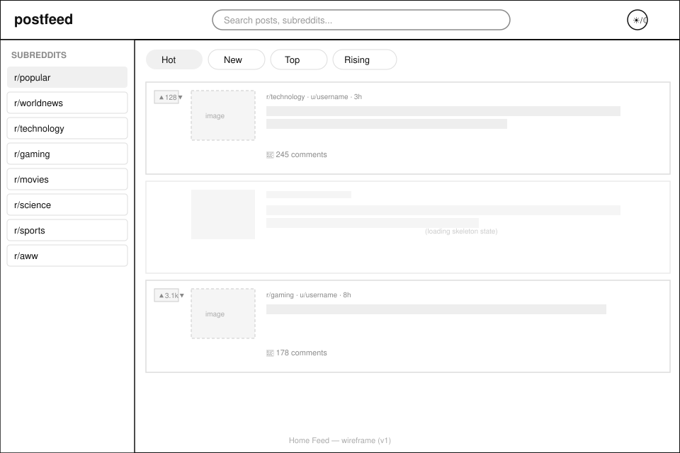
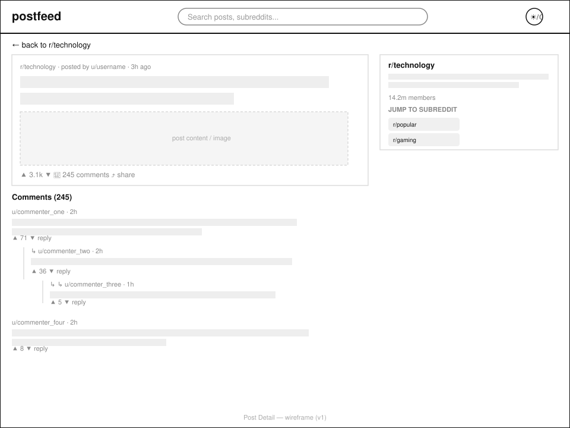
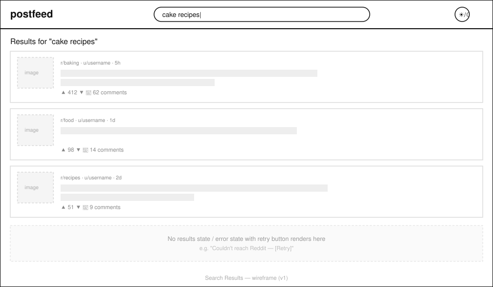

# postfeed

A Reddit client built with React and Redux Toolkit — a Codecademy Front-End Engineer Career Path portfolio project, built as a 3-person group project.

**Live site:** [posfteed-reddit.netlify.app](https://posfteed-reddit.netlify.app) *(update this link once your first real deploy is live)*

---

## Wireframes

### Home Feed
Subreddit sidebar, sort tabs (Hot / New / Top / Rising), and a scrolling list of post cards.



### Post Detail
Full post view with subreddit info and a nested comment thread indented by reply depth.



### Search Results
Search results list, plus the empty/error state with a retry action.



Full product spec, user stories, and implementation decisions: [`docs/PRD.md`](./docs/PRD.md)

---

## Technologies Used

- **React** — UI
- **Redux Toolkit + React Redux** — state management
- **React Router (v6)** — client-side routing
- **Vite** — build tool / dev server
- **Reddit JSON API** — data source (no auth — `.json` appended to Reddit URLs)
- **react-markdown** — rendering comment bodies
- **Jest + Enzyme** — unit tests
- **Cypress** — end-to-end tests
- **Netlify** — hosting + CI/CD (auto-deploy on push to `master`)

## Features

- Home feed defaulting to r/popular
- Predefined subreddit sidebar: r/popular, r/worldnews, r/technology, r/gaming, r/movies, r/science, r/sports, r/aww
- Sort by Hot / New / Top / Rising
- Keyword search across posts
- Full post detail view with nested, Markdown-rendered comments
- Skeleton loading states with shimmer animation
- Retry-able error states (handles Reddit's 10 req/min rate limit gracefully)
- Dark / light mode toggle
- Fully responsive, mobile to desktop
- 90+ Lighthouse scores (excluding Reddit-served media where noted in the spec)

## Team

| Role | Responsibilities |
|---|---|
| Team Lead / Core Developer | Redux architecture, API integration, routing, technical direction |
| UX/UI Designer–Developer | Design system, theming, animations, wireframe-to-CSS |
| Front-End Developer | Comment rendering, search, unit + e2e test suite |

## Getting Started

```bash
git clone https://github.com/abdioshaikhyt/postfeed.git
cd postfeed
npm install
npm run dev
```

## Running Tests

```bash
npm run test        # Jest + Enzyme unit tests
npx cypress open     # Cypress e2e tests
```

*(test scripts will be added as the test suite is built out)*

## Project Management

Task tracking and sprint planning is done in Jira, organised into epics matching the feature areas above (Home Feed, Post Detail & Comments, Search, Theming, Testing, Deployment).

## Out of Scope

- OAuth login, voting, commenting, or posting (Reddit's JSON API is read-only)
- Custom domain
- User accounts / saved posts
- Real-time updates

## Future Work

- OAuth-based login to support voting, commenting, and posting
- Progressive Web App support (installable, offline-friendly)
- Custom domain